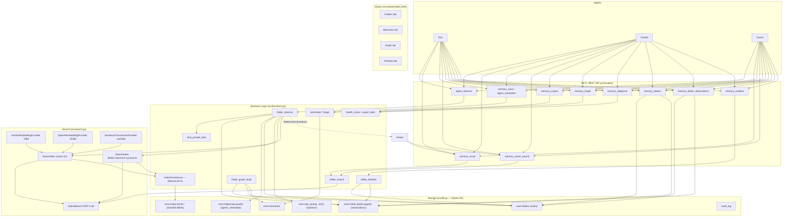
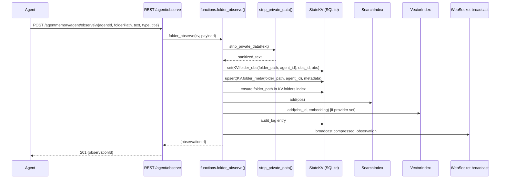
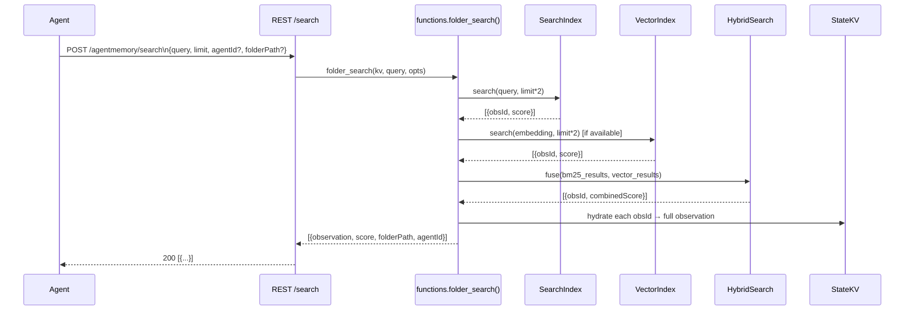

# Design Document: Folder-Based Memory

## Overview

This document describes the complete restructure of agentmemory-python from a **session-based** architecture to a **folder-based memory** model. The primary unit of storage shifts from `(session_id)` to `(folder_path, agent_id)` — each agent accumulates observations scoped to the folder it is working in, with no concept of "sessions". Long-term memories remain global. The viewer, MCP tools, and REST API are all reshaped around this model.

The redesign eliminates sessions, lessons, slots, actions, crystals, and artefacts entirely. What remains is: folder observations, global memories, BM25 + optional vector search, a folder-based graph, a folder activity feed (timeline), privacy stripping, and the MCP tool-calling interface.

---

## Architecture

### Implemented Module Layout

```
src/
├── app.py              Thin Flask factory — create_app(), WebSocket, CORS
├── workers.py          Background threads — index rebuild, auto-forget, SIGTERM handler
├── cli.py              CLI entrypoint (agentmemory serve/migrate/export)
├── connect.py          Client connection helper
├── db.py               StateKV — SQLite WAL, per-thread connections, stats()
├── functions.py        All canonical business logic (large; split planned)
├── search.py           BM25 + VectorIndex + HybridSearch + 3 embedding providers
├── viewer_helpers.py   Viewer HTML injection helper
│
├── routes/             Flask blueprints (A1 complete)
│   ├── observations.py   /observe, /agent/observe, /folders, /folder/observations
│   ├── memories.py       /remember, /agent/remember, /memories, /forget
│   ├── search.py         /search, /timeline
│   ├── graph.py          /graph, /graph/stats, /graph/query, /graph/build
│   ├── health.py         /livez, /health, /audit, /config/flags
│   ├── mcp.py            /mcp/tools GET+POST (12 active tools)
│   └── migration.py      /migrate
│
├── memory/             Thin shim package re-exporting from functions.py (A2.1)
│   ├── observe.py        folder_observe, observe, build_synthetic_compression, strip_private_data
│   ├── remember.py       remember, forget, jaccard_similarity
│   ├── context.py        context, export_data, rebuild_index
│   ├── graph.py          folder_graph_build
│   ├── timeline.py       folder_timeline, folder_search
│   └── health.py         health_check, auto_forget
│
├── storage/            KV scope registry + path utilities (A2.3)
│   ├── scopes.py         KV class (copy; canonical in functions.py)
│   ├── paths.py          normalize_folder_path, validate_agent_id, generate_id, fingerprint_id
│   └── images.py         save_image_to_disk, delete_image, touch_image
│
└── viewer/
    └── index.html      Single-file HTML dashboard (4 tabs: Folders/Memories/Graph/Timeline)
```

### High-Level System Diagram



---

## Sequence Diagrams

### agent_observe — Folder Observation Pipeline



### memory_recall — Hybrid Search



---

## Components and Interfaces

### Component 1: KV Scope Registry (src/functions.py + src/storage/scopes.py — `KV` class)

**Purpose**: Single source of truth for all KV scope names. Defined in `src/functions.py` (canonical) and mirrored to `src/storage/scopes.py` (A2.3).

**Active scopes:**

```python
class KV:
    # Folder memory index — key = "{folder_path}:{agent_id}", value = FolderIndexEntry
    folders = "mem:folders"

    # O(1) observation hydration index — key = obs_id, value = {folderPath, agentId}
    obs_lookup = "mem:obs_lookup"

    # Per-(folder, agent) observations — key = obs_id, value = FolderObservation
    @staticmethod
    def folder_obs(folder_path: str, agent_id: str) -> str:
        safe_path = folder_path.replace("\\", "/").strip("/")
        safe_agent = agent_id.strip()
        return f"mem:folder:{safe_path}:{safe_agent}"

    # Per-(folder, agent) metadata — key = "meta", value = FolderMeta
    @staticmethod
    def folder_meta(folder_path: str, agent_id: str) -> str:
        safe_path = folder_path.replace("\\", "/").strip("/")
        safe_agent = agent_id.strip()
        return f"mem:foldermeta:{safe_path}:{safe_agent}"

    # Global long-term memories (unchanged)
    memories = "mem:memories"

    # BM25 index shards (sharded, 2MB chunks)
    bm25Index = "mem:index:bm25"

    # Audit log
    audit = "mem:audit"

    # Graph edges (repurposed for folder graph)
    relations = "mem:relations"

    # Legacy scopes (read-only — for migration only)
    sessions = "mem:sessions"

    @staticmethod
    def observations(session_id: str) -> str:
        return f"mem:obs:{session_id}"

    # Legacy (retained for backward compat code paths)
    summaries = "mem:summaries"
    profiles = "mem:profiles"
    slots = "mem:slots"
    imageRefs = "mem:image-refs"
    globalSlots = "mem:global-slots"
```

**Notable addition**: `obs_lookup = "mem:obs_lookup"` — an O(1) reverse-lookup index that maps `obs_id → {folderPath, agentId}`, enabling fast hydration during search without scanning all folder scopes. Backfilled on startup via `backfill_obs_lookup_if_needed()`.

**Scopes fully removed from active use**: `lessons`, `actions`, `action-edges`, `crystals`, `sketches`, `facets`, `sentinels`, `signals`, `checkpoints`, `routines`, `routine-runs`, `semantic`, `procedural`, `commits`, `leases`, `mesh`, `recent-searches`, `claude-bridge`, `insights`, `retention`, `access`

---

### Component 2: FolderMemory — Core Data Model

**Purpose**: Represents a single `(folder_path, agent_id)` memory slice.

```python
# Observation stored under KV.folder_obs(folder_path, agent_id)
FolderObservation = {
    "id": str,            # generate_id("fobs")
    "folderPath": str,    # normalized absolute path, forward-slashes
    "agentId": str,       # e.g. "kiro", "claude", "cursor"
    "timestamp": str,     # ISO 8601 UTC
    "text": str,          # sanitized observation text (private data stripped)
    "type": str,          # "file_edit" | "command_run" | "search" | "conversation" | "other" ...
    "title": str,         # short summary ≤ 80 chars
    "concepts": list[str],# extracted concept tags
    "files": list[str],   # file paths referenced in this observation
    "importance": int,    # 1-10, default 5
}

# Metadata stored under KV.folder_meta(folder_path, agent_id)
FolderMeta = {
    "folderPath": str,
    "agentId": str,
    "lastUpdated": str,   # ISO timestamp of most recent observation
    "obsCount": int,
    "summary": str | None, # optional LLM-generated or auto-compressed summary
}

# Entry in the global folders index (KV.folders, key = "{folder_path}:{agent_id}")
FolderIndexEntry = {
    "folderPath": str,
    "agentId": str,
    "lastUpdated": str,
    "obsCount": int,
}
```

---

### Component 3: `folder_observe()` — Observation Ingestion

**Purpose**: Replace `observe()`. Accept a folder path + agent ID instead of session ID.

**Interface**:

```python
def folder_observe(kv: StateKV, payload: dict) -> dict:
    """
    Required payload fields:
        folderPath: str      — absolute path of working directory
        agentId: str         — identity of the agent making the observation
        text: str            — human-readable observation content
        timestamp: str       — ISO 8601 UTC

    Optional payload fields:
        type: str            — observation type (default "other")
        title: str           — short title (auto-generated from text if absent)
        concepts: list[str]  — tags
        files: list[str]     — referenced file paths
        importance: int      — 1-10 (default 5)

    Returns: {"observationId": str}
    Raises:  ValueError if required fields are missing or folder cap exceeded.
    """
```

**Responsibilities**:
- Validate `folderPath`, `agentId`, `text`, `timestamp`
- Call `strip_private_data(text)` before any storage
- Normalize `folderPath`: `os.path.normpath`, convert separators to `/`
- Generate `obs_id = generate_id("fobs")`
- Build observation dict, cap text at 4000 chars (same spirit as current `MAX_OBS_PER_SESSION`)
- Write to `KV.folder_obs(folder_path, agent_id)` under key `obs_id`
- Upsert `KV.folder_meta(folder_path, agent_id)`: increment `obsCount`, update `lastUpdated`
- Upsert `KV.folders` index entry (key = `"{folder_path}:{agent_id}"`)
- Add to BM25 index (`_bm25_index.add(obs)`)
- Add to vector index if provider available
- Schedule index persistence save
- Write audit log entry
- Broadcast to WebSocket viewers

---

### Component 4: `folder_search()` — Hybrid Search

**Purpose**: Search across all folder observations (and memories) using the existing BM25+vector pipeline.

```python
def folder_search(
    kv: StateKV,
    query: str,
    limit: int = 20,
    folder_path: Optional[str] = None,
    agent_id: Optional[str] = None,
) -> list[dict]:
    """
    Returns hydrated observations sorted by relevance.
    Optionally filtered to a specific folder or agent.
    Combines BM25 + vector via RRF (existing HybridSearch).
    Also includes matching global memories in results.
    """
```

---

### Component 5: `folder_timeline()` — Activity Feed

**Purpose**: Replace session-based timeline with a folder activity feed.

```python
def folder_timeline(
    kv: StateKV,
    limit: int = 100,
    folder_path: Optional[str] = None,
    agent_id: Optional[str] = None,
    before: Optional[str] = None,   # ISO timestamp upper bound
    after: Optional[str] = None,    # ISO timestamp lower bound
) -> list[dict]:
    """
    Collects observations across all (folder, agent) pairs from KV.folders index.
    Filters applied if folder_path or agent_id are provided.
    Sorts by timestamp descending.
    Returns at most `limit` entries.
    """
```

---

### Component 6: `folder_graph_build()` — Graph Data

**Purpose**: Build the graph payload for the viewer's Graph tab.

```python
def folder_graph_build(kv: StateKV) -> dict:
    """
    Nodes: one per unique folder_path that has at least one (folder, agent) entry.
    Node fields: {id, label, folderPath, agentIds, obsCount, color (from folderColor())}

    Edges:
      - Same-parent edge: two folders sharing the same parent directory.
      - Cross-reference edge: folder A's observations mention folder B's path.
      - Agent-shared edge: two folders have the same agentId with observations.

    Returns: {"nodes": [...], "edges": [...]}
    """
```

---

### Component 7: `remember()` / `forget()` — Global Memories (unchanged interface)

These functions remain as-is. `remember()` performs Jaccard deduplication at > 0.7 threshold and versions memories (`isLatest`, `parentId`). `forget()` now accepts either `memoryId` for global memories, or `folderPath` + `agentId` (+ optional `observationIds`) to delete folder observations.

**Updated `forget()` signature**:

```python
def forget(kv: StateKV, data: dict) -> dict:
    """
    Accepts:
        memoryId: str                — delete a global memory
        folderPath + agentId: str    — delete all observations for that (folder, agent)
        folderPath + agentId + observationIds: list[str]  — delete specific obs
    """
```

---

### Component 8: `health_check()` / `export_data()` — Diagnostics

**`health_check()`** updated to report folder counts instead of session counts:

```python
{
    "status": "ok",
    "folderCount": int,       # distinct folder paths with memory
    "agentCount": int,        # distinct agent IDs
    "pairCount": int,         # (folder, agent) pairs
    "observationCount": int,  # total observations across all pairs
    "memoryCount": int,       # global memories
    "bm25IndexSize": int,
    "vectorIndexSize": int,
    "dbPath": str,
}
```

**`export_data()`** updated structure:

```python
{
    "folders": [
        {
            "folderPath": str,
            "agentId": str,
            "meta": FolderMeta,
            "observations": [FolderObservation, ...]
        }
    ],
    "memories": [Memory, ...],
    "exportedAt": str,
    "version": "2.0",
}
```

---

## Data Models

### FolderObservation

```python
{
    "id": str,            # "fobs_<ts>_<rand12>"
    "folderPath": str,    # "/Users/alice/projects/my-app/src"  (normalized, forward slashes)
    "agentId": str,       # "kiro" | "claude" | "cursor" | any string
    "timestamp": str,     # "2025-01-15T10:30:00.000Z"
    "text": str,          # sanitized text, max 4000 chars
    "type": str,          # same infer_type() values as current: "file_edit", "command_run", etc.
    "title": str,         # ≤ 80 chars, auto-generated from text if absent
    "concepts": list,     # ["auth", "middleware"]
    "files": list,        # ["src/app.py", "src/db.py"]
    "importance": int,    # 1–10
}
```

**Validation rules**:
- `folderPath` must be non-empty after normalization
- `agentId` must be non-empty after stripping
- `text` must be non-empty before stripping; after `strip_private_data()` may contain `[REDACTED]`
- `timestamp` must be a parseable ISO 8601 string
- `importance` clamped to 1–10 range

### FolderMeta

```python
{
    "folderPath": str,
    "agentId": str,
    "lastUpdated": str,   # ISO timestamp
    "obsCount": int,      # incremented on each observation
    "summary": str | None,
}
```

### FolderIndexEntry (stored in `mem:folders`)

```python
# key = "{safe_folder_path}:{agent_id}"
{
    "folderPath": str,
    "agentId": str,
    "lastUpdated": str,
    "obsCount": int,
}
```

### Memory (unchanged)

```python
{
    "id": str,
    "createdAt": str,
    "updatedAt": str,
    "type": str,          # "fact" | "preference" | "architecture" | "bug" | "workflow" | "pattern"
    "title": str,
    "content": str,
    "concepts": list,
    "files": list,
    "strength": int,      # 1–10
    "version": int,
    "parentId": str | None,
    "supersedes": list,
    "isLatest": bool,
    "agentId": str | None,
    "project": str | None,  # optional — retained for backward compat during migration
}
```

---

## Algorithmic Pseudocode

### Main Observation Ingestion Algorithm

```pascal
ALGORITHM folder_observe(kv, payload)
INPUT:  payload dict with folderPath, agentId, text, timestamp, [type, title, concepts, files, importance]
OUTPUT: {"observationId": obs_id}

BEGIN
  ASSERT payload.folderPath IS NOT EMPTY
  ASSERT payload.agentId IS NOT EMPTY
  ASSERT payload.text IS NOT EMPTY
  ASSERT payload.timestamp IS valid ISO 8601

  // 1. Normalize and sanitize
  folder_path ← normalize_path(payload.folderPath)       // os.path.normpath, forward-slashes
  agent_id    ← payload.agentId.strip()
  safe_text   ← strip_private_data(payload.text)
  safe_text   ← safe_text[:4000]                          // hard cap

  // 2. Build observation
  obs_id ← generate_id("fobs")
  obs ← {
    id:         obs_id,
    folderPath: folder_path,
    agentId:    agent_id,
    timestamp:  payload.timestamp,
    text:       safe_text,
    type:       payload.type OR infer_type(safe_text),
    title:      payload.title OR safe_text[:80],
    concepts:   payload.concepts OR [],
    files:      extract_files(payload) OR [],
    importance: CLAMP(payload.importance OR 5, 1, 10),
  }

  // 3. Persist observation
  obs_scope ← KV.folder_obs(folder_path, agent_id)
  kv.set(obs_scope, obs_id, obs)

  // 4. Upsert folder metadata
  meta_scope ← KV.folder_meta(folder_path, agent_id)
  meta ← kv.get(meta_scope, "meta") OR {folderPath: folder_path, agentId: agent_id, obsCount: 0}
  meta.obsCount    ← meta.obsCount + 1
  meta.lastUpdated ← payload.timestamp
  kv.set(meta_scope, "meta", meta)

  // 5. Upsert global folders index
  index_key ← f"{folder_path}:{agent_id}"
  kv.set(KV.folders, index_key, {folderPath: folder_path, agentId: agent_id,
                                  lastUpdated: meta.lastUpdated, obsCount: meta.obsCount})

  // 6. Index for search
  _bm25_index.add(obs)
  IF embedding_provider IS NOT NULL THEN
    vector_index_add_guarded(obs_id, folder_path, obs.title + " " + obs.text, {})
  END IF

  IF _index_persistence IS NOT NULL THEN
    _index_persistence.schedule_save()
  END IF

  // 7. Audit + broadcast
  kv.commit_version(f"folder_observe: {obs_id}", agent_id)
  broadcast_stream({"type": "folder_observation", "folderPath": folder_path, "agentId": agent_id, "data": obs})

  RETURN {"observationId": obs_id}
END
```

**Preconditions:**
- `payload` contains non-empty `folderPath`, `agentId`, `text`, `timestamp`
- `kv` is an initialized `StateKV` instance

**Postconditions:**
- Observation is written to `KV.folder_obs(folder_path, agent_id)` under `obs_id`
- `KV.folder_meta(folder_path, agent_id)` has `obsCount` incremented and `lastUpdated` set
- `KV.folders` index has an entry for `(folder_path, agent_id)`
- BM25 index contains `obs_id`
- Audit log contains one new entry

**Loop invariants:** N/A (no loops in the main path)

---

### Folder Timeline Algorithm

```pascal
ALGORITHM folder_timeline(kv, limit, folder_path?, agent_id?, before?, after?)
INPUT:  optional filters; limit defaults to 100
OUTPUT: list of FolderObservation sorted by timestamp DESC

BEGIN
  index_entries ← kv.list(KV.folders)

  // Apply folder/agent filters to index
  IF folder_path IS NOT NULL THEN
    index_entries ← FILTER index_entries WHERE entry.folderPath = folder_path
  END IF
  IF agent_id IS NOT NULL THEN
    index_entries ← FILTER index_entries WHERE entry.agentId = agent_id
  END IF

  all_obs ← []

  FOR each entry IN index_entries DO
    // Loop invariant: all_obs contains only observations that match filters applied so far
    obs_scope ← KV.folder_obs(entry.folderPath, entry.agentId)
    obs_list  ← kv.list(obs_scope)

    // Apply timestamp filters
    IF before IS NOT NULL THEN
      obs_list ← FILTER obs_list WHERE obs.timestamp < before
    END IF
    IF after IS NOT NULL THEN
      obs_list ← FILTER obs_list WHERE obs.timestamp > after
    END IF

    all_obs.extend(obs_list)
  END FOR

  all_obs.sort(key=lambda o: o.timestamp, reverse=True)
  RETURN all_obs[:limit]
END
```

**Preconditions:**
- `kv` is initialized
- `limit` ≥ 1

**Postconditions:**
- Returns at most `limit` observations
- All returned observations satisfy the provided filter conditions
- Results are ordered by `timestamp` descending

**Loop invariant:** After each iteration, `all_obs` contains only observations from folders/agents matching the filter; all observations are within the timestamp range if filters were given.

---

### Folder Graph Build Algorithm

```pascal
ALGORITHM folder_graph_build(kv)
INPUT:  none (reads from KV)
OUTPUT: {nodes: list[GraphNode], edges: list[GraphEdge]}

BEGIN
  index_entries ← kv.list(KV.folders)

  // Build node map keyed by folder_path
  folder_map ← {}                // folder_path → {folderPath, agentIds: set, obsCount, color}
  pair_obs_texts ← {}            // (folder_path, agent_id) → concatenated obs text

  FOR each entry IN index_entries DO
    fp ← entry.folderPath
    IF fp NOT IN folder_map THEN
      folder_map[fp] ← {folderPath: fp, agentIds: set(), obsCount: 0, color: folderColor(fp)}
    END IF
    folder_map[fp].agentIds.add(entry.agentId)
    folder_map[fp].obsCount ← folder_map[fp].obsCount + entry.obsCount

    // Collect obs text for cross-reference edge detection
    obs_list ← kv.list(KV.folder_obs(fp, entry.agentId))
    combined ← JOIN [o.text + " " + o.title FOR o IN obs_list]
    pair_obs_texts[(fp, entry.agentId)] ← combined
  END FOR

  nodes ← [build_node(fp, info) FOR fp, info IN folder_map.items()]

  edges ← []
  folder_paths ← list(folder_map.keys())

  // Edge type 1: same-parent edges
  FOR i IN range(len(folder_paths)) DO
    FOR j IN range(i+1, len(folder_paths)) DO
      // Loop invariant: all pairs (a, b) with a < j and b ≤ j have been evaluated
      a ← folder_paths[i]
      b ← folder_paths[j]
      IF parent(a) = parent(b) THEN
        edges.append({source: a, target: b, type: "same-parent"})
      END IF
    END FOR
  END FOR

  // Edge type 2: cross-reference edges (folder A's text mentions folder B's path)
  FOR (fp_a, agent_a), text_a IN pair_obs_texts.items() DO
    FOR fp_b IN folder_paths DO
      IF fp_b ≠ fp_a AND fp_b IN text_a THEN
        IF NOT edge_exists(edges, fp_a, fp_b, "cross-ref") THEN
          edges.append({source: fp_a, target: fp_b, type: "cross-ref"})
        END IF
      END IF
    END FOR
  END FOR

  // Edge type 3: agent-shared edges (two folders with same agent)
  agent_to_folders ← group folder_paths by agentIds
  FOR agent_id, fps IN agent_to_folders.items() DO
    FOR i IN range(len(fps)) DO
      FOR j IN range(i+1, len(fps)) DO
        edges.append({source: fps[i], target: fps[j], type: "agent-shared", agentId: agent_id})
      END FOR
    END FOR
  END FOR

  RETURN {nodes: nodes, edges: DEDUPLICATE(edges)}
END
```

**Preconditions:** `kv` is initialized; `KV.folders` may be empty (returns `{nodes: [], edges: []}`)

**Postconditions:**
- One node per unique `folder_path` in `KV.folders`
- Edges only connect distinct nodes
- No duplicate edges (same source, target, type)

---

## Key Functions with Formal Specifications

### `normalize_folder_path(path: str) -> str`

```python
def normalize_folder_path(path: str) -> str
```

**Preconditions:** `path` is a non-empty string
**Postconditions:**
- Returns path with OS separators replaced by `/`
- No leading or trailing slashes
- `os.path.normpath` applied (resolves `..`, double slashes)
- Result is non-empty

### `folder_observe(kv, payload) -> dict`

**Preconditions:** `kv` initialized; `payload` has `folderPath`, `agentId`, `text`, `timestamp`
**Postconditions:**
- `result["observationId"]` is a string matching pattern `fobs_*`
- `kv.get(KV.folder_obs(fp, aid), result["observationId"])` returns the stored obs
- `kv.get(KV.folder_meta(fp, aid), "meta")["obsCount"]` is incremented by 1
- `kv.get(KV.folders, f"{fp}:{aid}")` is non-None

### `folder_timeline(kv, limit, ...) -> list`

**Preconditions:** `kv` initialized; `limit ≥ 1`
**Postconditions:**
- `len(result) ≤ limit`
- `all(result[i]["timestamp"] >= result[i+1]["timestamp"] for i in range(len(result)-1))`
- If `folder_path` filter set: all `result[i]["folderPath"] == folder_path`
- If `agent_id` filter set: all `result[i]["agentId"] == agent_id`

### `forget(kv, data) -> dict`

**Preconditions:** At least one of `memoryId`, `folderPath+agentId` is present
**Postconditions:**
- If `memoryId` given: `kv.get(KV.memories, memoryId)` returns None
- If `folderPath+agentId` given (no obs IDs): all observations in `KV.folder_obs(fp, aid)` are deleted; `KV.folders` index entry is removed; `KV.folder_meta(fp, aid)` is deleted
- `result["deleted"]` equals number of items actually removed from storage

---

## Migration Strategy from Current Schema

### Migration Approach: Non-Destructive Lazy Read

The migration does not require a destructive DB transformation at startup. Instead:

1. **New data** is written using the folder-based schema immediately after deployment.
2. **Old session data** is left in the DB under its original scopes (`mem:sessions`, `mem:obs:*`, etc.) and can be optionally migrated via a `POST /agentmemory/migrate` endpoint.
3. The search index rebuild (`rebuild_index()`) is updated to read from both old observation scopes and new folder observation scopes — this ensures the BM25 index is populated regardless of which format data exists in.

### Migration Endpoint

```pascal
ALGORITHM migrate_sessions_to_folders(kv, dry_run=False)
INPUT:  kv, dry_run flag
OUTPUT: {migrated_sessions, migrated_observations, errors}

BEGIN
  sessions ← kv.list("mem:sessions")
  migrated_sessions ← 0
  migrated_observations ← 0
  errors ← []

  FOR each session IN sessions DO
    folder_path ← session.cwd OR session.project OR "unknown"
    agent_id    ← session.agentId OR "unknown"
    obs_list    ← kv.list(KV.observations(session.id))      // "mem:obs:{session_id}"

    FOR each obs IN obs_list DO
      IF obs.id ends with ":raw" THEN CONTINUE END IF   // skip raw duplicates

      folder_obs ← {
        id:         obs.id,
        folderPath: normalize_folder_path(folder_path),
        agentId:    agent_id,
        timestamp:  obs.timestamp,
        text:       obs.narrative OR obs.title OR "",
        type:       obs.type OR "other",
        title:      obs.title OR "",
        concepts:   obs.concepts OR [],
        files:      obs.files OR [],
        importance: obs.importance OR 5,
      }

      IF NOT dry_run THEN
        kv.set(KV.folder_obs(folder_path, agent_id), obs.id, folder_obs)
        migrated_observations ← migrated_observations + 1
      END IF
    END FOR

    IF NOT dry_run THEN
      // Upsert metadata + index
      upsert_folder_meta(kv, folder_path, agent_id, len(obs_list), session.updatedAt)
      migrated_sessions ← migrated_sessions + 1
    END IF
  END FOR

  RETURN {migrated_sessions, migrated_observations, errors}
END
```

**The old scopes are never deleted automatically** — they can be cleaned up manually after verifying the migration via `POST /agentmemory/migrate?cleanup=true`.

---

## MCP Tools: Implemented

The server exposes **12 MCP tools** via `GET /agentmemory/mcp/tools` and `POST /agentmemory/mcp/tools`.

### Active Tools

| Tool | Description | Notes |
|------|-------------|-------|
| `agent_observe` | Log observation to a `(folderPath, agentId)` pair | Required: `folderPath`, `agentId`, `text`. Legacy `sessionId`/`cwd`/`project` accepted as fallback. |
| `agent_remember` | Save to global long-term memory | Unchanged |
| `memory_recall` | BM25+vector search across folder obs + global memories | Optional `folderPath`/`agentId` filters |
| `memory_smart_search` | Alias for `memory_recall` (hybrid search) | Same implementation |
| `memory_save` | Explicit save to global memory | Unchanged |
| `memory_export` | Export all data as JSON v2 format | `{folders: [...], memories: [...], version: "2.0"}` |
| `memory_forget` | Delete memory or folder pair | Accepts `memoryId` OR `folderPath+agentId` |
| `memory_diagnose` | Health check — folder/agent/obs/memory counts | Replaces session-based counts |
| `memory_folders` | List all `(folder, agent)` pairs | Returns sorted by `lastUpdated` |
| `memory_folder_observations` | Get observations for a specific pair | Required: `folderPath`, `agentId` |
| `memory_timeline` | Folder activity feed | Optional `folderPath`, `agentId`, `limit`, `before`, `after` |

### Removed Tools (from original session-based model)

`memory_sessions`, `memory_sessions_list`, `memory_observations` (session-based), `memory_profile`, `memory_lessons`, `memory_lesson_save`, `memory_lesson_recall`, `memory_lesson_search`, `memory_consolidate`, `memory_reflect`, `memory_crystallize`, `memory_slot_list`, `memory_slot_get`, `memory_slot_create`, `memory_slot_append`, `memory_slot_replace`, `memory_slot_delete`, `memory_action_create`, `memory_action_update`, `memory_frontier`, `memory_antigravity_sync`, `memory_antigravity_sync_all`

---

## REST Endpoints: Implemented

### Active Endpoints

| Method | Path | Blueprint | Description |
|--------|------|-----------|-------------|
| POST | `/agentmemory/observe` | observations | Legacy compat shim — maps to folder_observe |
| POST | `/agentmemory/agent/observe` | observations | Folder observation ingest (strict) |
| GET | `/agentmemory/folders` | observations | List all (folder, agent) pairs |
| GET | `/agentmemory/folder/observations` | observations | Observations for a pair |
| POST | `/agentmemory/session/start` | observations | Legacy compat no-op → returns synthetic session ID |
| POST | `/agentmemory/session/end` | observations | Legacy compat no-op |
| GET | `/agentmemory/observations` | observations | Legacy compat reads from `mem:obs:{sessionId}` |
| POST | `/agentmemory/remember` | memories | Save global memory |
| POST | `/agentmemory/agent/remember` | memories | Save global memory (agent-scoped variant) |
| GET | `/agentmemory/memories` | memories | List global memories |
| POST | `/agentmemory/forget` | memories | Delete memory / folder pair |
| POST | `/agentmemory/search` | search | BM25+vector hybrid search |
| POST | `/agentmemory/timeline` | search | Folder activity feed |
| GET | `/agentmemory/graph` | graph | Graph nodes+edges |
| GET | `/agentmemory/graph/stats` | graph | Node/edge count |
| POST | `/agentmemory/graph/query` | graph | Reserved (returns empty) |
| POST | `/agentmemory/graph/build` | graph | Trigger consolidation if enabled |
| GET | `/agentmemory/livez` | health | Liveness probe (no auth) |
| GET | `/agentmemory/health` | health | Full health check |
| GET | `/agentmemory/audit` | health | Audit log |
| GET | `/agentmemory/config/flags` | health | Feature flags + provider info |
| GET | `/agentmemory/mcp/tools` | mcp | MCP tool schemas |
| POST | `/agentmemory/mcp/tools` | mcp | MCP tool dispatch |
| POST | `/agentmemory/migrate` | migration | Session → folder migration |

---

## Viewer Dashboard Restructure

### New Tab Structure

| Tab | Content |
|-----|---------|
| **Folders** | List all `(folder, agent)` pairs — shows `folderPath`, `agentId`, `obsCount`, `lastUpdated`. Click a row to drill into that pair's observations. |
| **Memories** | Unchanged — global long-term memories with search |
| **Graph** | Force-directed graph where nodes = folder paths, edges = same-parent / cross-ref / agent-shared relationships. Uses existing `folderColor()` function. |
| **Timeline** | All observations across all pairs, sorted by timestamp desc. Filter bar: folder path (text match), agent dropdown. |

### Removed Tabs

Sessions, Lessons, Slots, Actions, Replay, Profile, Crystals

### Viewer Data Endpoints (New REST calls)

```
GET  /agentmemory/folders                         → [{folderPath, agentId, obsCount, lastUpdated}]
GET  /agentmemory/folder/observations?folderPath=&agentId=  → {observations: [...]}
POST /agentmemory/timeline                        → {observations: [...]}  (body: {folderPath?, agentId?, limit?, before?, after?})
GET  /agentmemory/graph                           → {nodes: [...], edges: [...]}
```

### Folders Tab — Drill-Down Detail View

When a `(folder, agent)` row is clicked:
- Header shows `folderPath` + `agentId` badge
- Observations listed chronologically (oldest first), each showing `timestamp`, `type` badge, `title`, `text` excerpt
- `summary` field shown if present (LLM or auto-generated)
- "Delete folder memory" button calls `POST /agentmemory/forget` with `{folderPath, agentId}`

---

## Error Handling

### Error Scenario 1: Missing Required Fields in `agent_observe`

**Condition**: `folderPath`, `agentId`, or `text` missing from payload  
**Response**: HTTP 400 `{"error": "folderPath, agentId, and text are required"}`  
**Recovery**: Agent retries with all required fields

### Error Scenario 2: Observation Cap Reached

**Condition**: `(folder_path, agent_id)` pair has reached `MAX_OBS_PER_FOLDER` (env var, default 2000)  
**Response**: HTTP 400 `{"error": "Folder observation limit reached (2000)"}`  
**Recovery**: Agent calls `memory_forget` to prune old observations, or increases the cap

### Error Scenario 3: Path Traversal Attempt

**Condition**: `folderPath` contains `..` that after normalization escapes expected boundaries  
**Response**: HTTP 400 `{"error": "Invalid folderPath"}`  
**Recovery**: Agent provides an absolute, non-traversal path

### Error Scenario 4: Search Index Empty on Startup

**Condition**: BM25 index is empty (fresh install or corrupted shard)  
**Response**: Search returns empty results; background thread rebuilds index from all folder observations  
**Recovery**: Automatic — `rebuild_index()` iterates `KV.folders` index and re-adds all observations

### Error Scenario 5: Migration Endpoint Failure

**Condition**: Old session data is malformed or a session has no `cwd`/`project`  
**Response**: `errors` list in migration response captures per-session failures; migration continues for other sessions  
**Recovery**: Manual cleanup; old scopes remain untouched

---

## Testing Strategy

### Unit Testing Approach

Use `pytest`. No test runner currently configured — add `pytest` to `requirements.txt` dev deps.

Key unit test targets:
- `normalize_folder_path()`: edge cases (Windows paths, trailing slashes, `..` segments, UNC paths)
- `strip_private_data()`: existing coverage patterns + folder-path-specific cases
- `folder_observe()`: required field validation, obs ID generation, meta increment, index upsert
- `forget()` with folder targets: verifies all scopes cleaned up
- `folder_timeline()`: timestamp ordering, filter correctness, limit enforcement
- `folder_graph_build()`: node deduplication, edge type correctness, empty case

### Property-Based Testing Approach

Use `hypothesis` for:
- Any `normalize_folder_path(p)` — result is always a non-empty string with no trailing slash
- `folder_timeline()` result is always sorted (timestamps non-increasing)
- `folder_observe()` followed by `forget()` leaves zero observations for that pair

### Integration Testing Approach

End-to-end test using a temp SQLite DB:
1. Call `folder_observe()` with 3 different `(folder, agent)` combinations
2. Assert all 3 are returned by `folder_timeline()` in correct order
3. Assert `folder_search("some keyword")` returns the matching observation
4. Assert `folder_graph_build()` produces 3 nodes and correct edges
5. Call `forget({folderPath, agentId})` and assert observations deleted from search index

---

## Performance Considerations

- **Observation scope keys**: `mem:folder:{path}:{agent}` keys can become very long for deep paths. The `kv.list()` call uses `SELECT ... WHERE scope = ?` which is an exact match — long scope strings are fine for SQLite. The `idx_kv_scope` index on `kv_store(scope)` ensures O(log N) lookup.
- **Timeline query cost**: Reading all observations across all folders is O(total_observations). For large deployments, this is mitigated by the `limit` cap and the timestamp filter being applied in Python (post-fetch). A future optimization is to add a `ts` column to `kv_store` for SQL-level filtering.
- **Graph build cost**: `folder_graph_build()` does full text scanning of observations for cross-reference edges. This is acceptable for the viewer (user-triggered) but should not run on every request. Cache the graph payload with a 30-second TTL or invalidate on any new `folder_observe()`.
- **BM25 rebuild**: `rebuild_index()` iterates all scopes. With the new schema, it must iterate `KV.folders` index entries and load each pair's observations — same O(N) complexity as before.
- **Existing search.py and IndexPersistence are unchanged** — no performance regression in the search pipeline.

---

## Security Considerations

- **Path normalization** before storage prevents `..` traversal in KV scope keys. `os.path.normpath()` is called before any KV write.
- **`strip_private_data()`** is called on `text` before storage — same patterns as current (API keys, JWTs, Bearer tokens, etc.).
- **Auth**: All new endpoints follow the existing `check_auth()` pattern using `hmac.compare_digest`.
- **Scope injection**: `folder_path` and `agent_id` are embedded in KV scope strings. Both are normalized (control chars stripped, length capped at 512 chars) before scope construction to prevent scope collision or injection via crafted path strings.
- **`MAX_OBS_PER_FOLDER`** cap prevents unbounded storage growth per pair, mitigating denial-of-service via observation flooding.

---

## Dependencies

All dependencies are already present in `requirements.txt`. No new packages required:

| Package | Used for |
|---------|----------|
| `flask` | REST server |
| `flask-sock` | WebSocket broadcaster |
| `python-dateutil` | ISO timestamp parsing in timeline filters |
| `huggingface_hub` | HF Space sync (unchanged) |

Optional (already supported):
| Package | Used for |
|---------|----------|
| `requests` | Gemini embedding API calls |
| `jieba` | CJK segmentation in BM25 tokenizer |

New dev dependency for tests:
| Package | Used for |
|---------|----------|
| `pytest` | Unit and integration tests |
| `hypothesis` | Property-based tests |

---

## Correctness Properties

The following properties must hold universally across the system:

### Property 1: Pair Isolation

For all `(folder_path_a, agent_a)` and `(folder_path_b, agent_b)` where the pairs are distinct, observations written to pair A are never returned when reading pair B's observations directly.

`∀ a ≠ b: kv.list(KV.folder_obs(a)) ∩ kv.list(KV.folder_obs(b)) = ∅`

### Property 2: Observation Count Consistency

After any sequence of `folder_observe()` calls for a pair, `KV.folder_meta(fp, aid)["obsCount"]` equals the number of observations stored in `KV.folder_obs(fp, aid)`.

`obsCount = len(kv.list(KV.folder_obs(fp, aid)))`

### Property 3: Index Coverage

Every `(folder_path, agent_id)` pair that has at least one observation is present in the global `KV.folders` index.

`∀ (fp, aid): len(kv.list(KV.folder_obs(fp, aid))) > 0 ⟹ kv.get(KV.folders, f"{fp}:{aid}") IS NOT NULL`

### Property 4: Privacy Invariant

No observation stored in `KV.folder_obs(fp, aid)` contains a string matching any pattern in `SECRET_PATTERN_SOURCES`. Text is sanitized by `strip_private_data()` before every write.

### Property 5: Timeline Ordering

`folder_timeline()` always returns results in non-increasing timestamp order.

`∀ i < j in result: result[i].timestamp ≥ result[j].timestamp`

### Property 6: Forget Completeness

After `forget({folderPath: fp, agentId: aid})` with no specific `observationIds` completes: `kv.list(KV.folder_obs(fp, aid))` is empty, `kv.get(KV.folders, f"{fp}:{aid}")` is None, and the BM25 index contains no entries originating from that pair.

### Property 7: Memory Versioning

At most one memory with a given conceptual content (Jaccard similarity > 0.7) has `isLatest = True` at any point in time. All superseded versions have `isLatest = False` and `parentId` set.

### Property 8: Path Normalization Idempotency

`normalize_folder_path` is idempotent: applying it twice produces the same result as applying it once.

`normalize_folder_path(normalize_folder_path(p)) == normalize_folder_path(p)` for all non-empty strings `p`.

### Property 9: Search Index Sync

Every observation added via `folder_observe()` is present in `_bm25_index` under its `obs_id`. Every observation deleted via `forget()` is absent from `_bm25_index` after the operation completes.

### Property 10: Graph Node Uniqueness

`folder_graph_build()` produces exactly one node per distinct `folder_path` in `KV.folders`, regardless of how many `agent_id` values are associated with that folder path.
