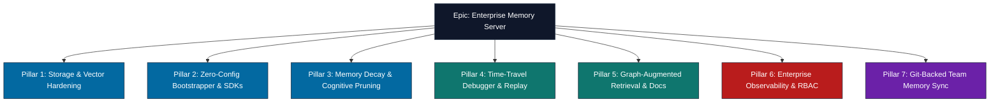

# Epic: Enterprise-Grade Memory, Context Ingestion, & Database Scaling for `agentcache`

This document outlines the product epic for transforming `agentcache` into an industry-leading, production-grade memory server for AI coding agents. It covers database scaling, zero-config onboarding, cognitive pruning, observability, and team-based memory synchronization.

---



---

## Pillar 1: Core Datastore & Vector Hardening (Pluggable Storage)
To run in production with millions of logs and observations, the core storage and vector indices must scale beyond a single SQLite file and in-memory list arrays.

### 1. Storage Layer Interface (`BaseStorage`)
Abstract all database key-value operations behind a unified repository interface:
* **Interface Definition:** Abstract operations `get`, `set`, `delete`, `list`, and `commit`.
* **Swappable Backends:**
  - `SQLiteStorage`: Optimized default backend featuring tuned WAL and memory-mapped pragmas.
  - `PostgreSQLStorage`: Scalable production backend storing scope data inside `JSONB` columns with GIN indexing.
  - `RedisStorage`: High-speed memory storage for volatile and ephemeral caching environments.

### 2. Out-of-Process Vector Indexing (`BaseVectorIndex`)
Move beyond holding float32 list arrays in Python process memory, which bloats and slows search queries over time.
* **Interface Definition:** Abstract vector insertion, eviction, and cosine similarity query runs.
* **Swappable Backends:**
  - `InMemoryVectorIndex`: Flat-list memory storage (default).
  - `QdrantVectorIndex` / `ChromaVectorIndex`: Offloads embedding storage and spatial indexing to external, specialized vector database services, enabling sub-10ms hybrid search queries.

---

## Pillar 2: Zero-Config Context Ingestion & Client SDKs
Minimize developer friction by automating prompt context bootstrap and exposing clean programming clients.

### 1. Auto-Context Bootstrapper (`agentcache bootstrap`)
* **The Problem:** Coding agents have to waste token limits and execution time calling MCP tools like `memory_recall` at startup just to figure out "what was I doing here?".
* **The Solution:** A background directory watcher writes the latest active tasks, recent lessons, and pinned slots to a local `.agentcache_context.md` file in the project.
* **Execution:** Since agents (Cursor, Cline, Windsurf) automatically read local files on boot, context is injected into their initial system prompt automatically, saving token overhead.

### 2. Client SDK Packages
* **Python SDK (`agentcache-client`):** Programmatic async client wrappers:
  ```python
  from agentcache import AgentCacheClient
  client = AgentCacheClient(url="http://localhost:3111", token="...")
  client.observe(folder="./src", agent="coder", text="Refactored modules")
  ```
* **TypeScript SDK (`@agentcache/client`):** Native Node.js package to simplify integrations inside VS Code extensions and JavaScript agent scripts.

---

## Pillar 3: Memory Decay & Cognitive Pruning (Noise Erasure)
AI agents generate vast volumes of raw tool execution logs. Without pruning, search results become polluted with transient noise, inflating context sizes and costs.

### 1. Time-To-Live (TTL) on Transient Data
* Tag incoming logs with TTLs. EPhemeral warnings, intermediate compiler failures, and temporary shell outputs are deleted automatically after a short duration (e.g. 2 hours).
* If a "build passed" or "test successful" observation is logged, previous compiler errors in that folder are immediately deleted.

### 2. Semantic Compression (Episode Crystallization)
* Once a folder pair reaches a threshold of observations, run a background LLM consolidation sweep.
* Compress those observations into high-level semantic facts (e.g., "Resolved circular imports in auth.py by using lazy imports").
* Store the consolidated summaries as permanent memories and evict the underlying raw log observations.

---

## Pillar 4: Time-Travel Debugger & Interactive Trace Replay
Provide developer visibility and trace debugging controls for agent loops and mental states.

### 1. Interactive Trace Replay
* A debugger screen in the HTML dashboard allowing developers to step forward or backward through each event in an agent's history.
* **Cognitive Diffs:** Side-by-side visualization showing file changes, prompt context, tool outcomes, and memory states at each execution step.
* **Mental Model Correction:** Allow developers to edit or inject memories mid-run, correcting the agent's assumptions before resuming execution.

---

## Pillar 5: Graph-Augmented Retrieval (GRAG) & Auto-Documentation
Combine vector similarity with topological relations to improve query relevance and developer documentation.

### 1. Topological Search Expansion
* Vector similarity only matches text similarity. Codebases are topological (e.g., `UserAuth` calls `db.py`, which is loaded by `routes/auth.py`).
* Traverse Knowledge Graph relations to pull adjacent files, parent folders, and concept associations into search results, giving the agent a structural map of the codebase.

### 2. Auto-Documentation Generator (`memory_crystalize_docs`)
* An MCP tool and API endpoint that reads the consolidated semantic and procedural memories of all agent runs.
* Automatically compiles them into structured developer documentation (e.g., `ARCHITECTURE.md` or `DEVELOPER_GUIDE.md`), explaining workarounds and design decisions.

---

## Pillar 6: Enterprise Observability & Multi-Token RBAC Security
Prepare `agentcache` for enterprise networks and cloud environments through secure and monitored interfaces.

### 1. Multi-Token Role-Based Access Control (RBAC)
* Implement timing-safe HMAC verification against multiple client tokens.
* Enforce access privileges:
  - `Viewer Token`: Read-only access to HTML dashboard.
  - `Agent Token`: Scoped read-write access to specific folder namespaces.
  - `Admin Token`: Full control over migrations, settings, and database purges.

### 2. Operations Telemetry
* **Structured JSON Logging:** Replace raw standard prints with standard python `logging` outputting JSON, allowing simple ingestion by log aggregators (Splunk, ELK, Datadog).
* **Prometheus Metrics:** Expose `/metrics` containing:
  - Active WebSocket client counts.
  - SQLite WAL size and connection pool details.
  - Execution latencies for BM25, Vector, and Hybrid search runs.

---

## Pillar 7: Git-Backed Team Memory Synchronization
Enable developer teams to share agent learnings using existing Git repository workflows.

### 1. Repository-Level Snapshots
* A CLI command `agentcache export --format=db --type=semantic` that compiles and outputs a highly compressed SQLite snapshot containing only semantic/procedural memories.
* Store this snapshot under `.agentcache/project_memories.db` in the repository.

### 2. Git Hook Automation
* **Pre-commit hook:** Automatically triggers memory consolidation and commits the updated lightweight snapshot.
* **Post-pull hook:** Merges the incoming memory snapshot into the developer's local `agentcache` SQLite database.
* **Result:** Every developer on the team benefits from the collective intelligence of all agents running in the repository.
