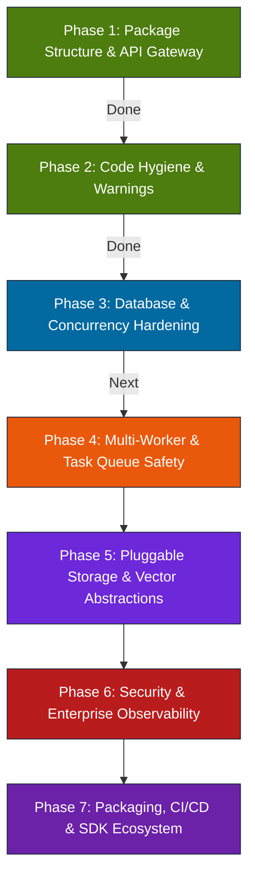

# Production Readiness & PyPI Publishing Roadmap

This document outlines the systematic, step-by-step transition of `agentcache` from a local development tool to an enterprise-grade, highly-available, production-ready service and distributable Python library. 

As a persistent memory server for AI agents, `agentcache` must guarantee data consistency, fast search latency, high concurrent write handling, and secure operation under load. This roadmap addresses the structural, architectural, and operational improvements required to achieve this level of maturity.

---



---

## Phase 1: Package Restructuring & Packaging Design (Completed)
Adopted the standard Python `src/` layout to ensure clean namespace isolation and prevent installation path collisions.

- [x] **Namespace Migration:** Relocated core modules from flat `src/` to `src/agentcache/`.
- [x] **Top-Level Exports:** Configured `src/agentcache/__init__.py` to expose programmatic endpoints (`StateKV`, `create_app`, `folder_observe`, `remember`, etc.) for clean client imports.
- [x] **Package Resources:** Updated `app.py` to use `importlib.resources.files` to resolve the static HTML viewer directory path, avoiding fragile `__file__` calculations.
- [x] **Command Line Entrypoint:** Configured `agentcache = agentcache.cli:main` as the official console script entrypoint in `pyproject.toml`.

---

## Phase 2: Code Hygiene & Warning Resolution (Completed)
Addressed deprecation warnings and database queries that would cause operational errors under load.

- [x] **Python 3.12+ Datetime Compliance:** Replaced naive `datetime.datetime.utcnow()` with timezone-aware `datetime.datetime.now(datetime.timezone.utc)` and standard formatters, eliminating 200+ deprecation warnings during testing.
- [x] **SQLite Parameterization Fix:** Cleaned up SQL syntax parameter placeholders from `%s` (Postgres/MySQL) to `?` (SQLite) inside index cleanup operations, resolving silent cleanup failures and preventing database bloat.
- [x] **Test Path Cleanup:** Eliminated manual `sys.path.insert` hacks in the `tests/` directory, moving to package-level imports utilizing editable install hooks (`pip install -e .`).

---

## Phase 3: Database Concurrency & SQLite Hardening (Active)
To run in production with multiple concurrent agents writing logs, the database layer must prevent locking bottlenecks and handle concurrent access gracefully.

### 1. Advanced SQLite WAL Tuning
SQLite WAL (Write-Ahead Logging) is already enabled, but it needs specific pragmas optimized for concurrent reads/writes:
- **`PRAGMA synchronous = NORMAL;`** (Reduces disk I/O, extremely safe in WAL mode because WAL is transactional and checksummed).
- **`PRAGMA journal_size_limit = 67108864;`** (Caps WAL file size at 64MB, preventing unbounded WAL growth and optimizing read scan performance).
- **`PRAGMA mmap_size = 268435456;`** (Enables memory-mapped I/O up to 256MB, greatly accelerating read queries and search operations).

### 2. Lock & Busy State Handlers
SQLite throws `SQLITE_BUSY` when a write connection blocks another. We must configure a longer timeout and implement a pythonic backoff decorator for database transactions.
```python
# In src/agentcache/db.py connection setup
conn = sqlite3.connect(self.db_path, check_same_thread=False, timeout=30.0)
```
- **Transaction Retry Decorator:** Wrap database updates and transaction commits in a retry loop with randomized exponential backoff (e.g., `tenacity` or custom implementation) to handle transient database locks under high concurrent write loads.

### 3. Explicit SQLite Write Transaction Lock
Ensure all methods executing writes (`set`, `delete`, `update`, `commit_version`) acquire an internal thread lock (`self._lock`) to serialize write requests inside the Python process before they reach the database driver.

---

## Phase 4: Multi-Worker & Task Queue Safety
When deployed in a production WSGI container (e.g., `Gunicorn` with multiple worker processes), background threads running inside the Flask app (`src/agentcache/workers.py` for indexing and auto-forget sweeps) spawn multiple times, causing race conditions and database locks.

```
       [ Client Request ]
               │
      ┌────────┴────────┐
      ▼ (WSGI Master)   ▼
 ┌─────────────┐   ┌─────────────┐
 │  Worker P1  │   │  Worker P2  │
 ├─────────────┤   ├─────────────┤
 │ - App Code  │   │ - App Code  │
 │ - Thread:   │   │ - Thread:   │
 │   Index/    │   │   Index/    │
 │   AutoForget│   │   AutoForget│
 └──────┬──────┘   └──────┬──────┘
        └────────┬────────┘
                 ▼
          [ sqlite3.db ] (Locks & Collision Risk)
```

### Action Items
1. **Single-Worker Sweep Locking:** Implement a database-backed distributed lock (stored in a `mem:locks` metadata scope) to ensure that only one worker runs index-rebuild or auto-forget sweeps at any given time.
2. **Process-Level CLI Commands:** Create CLI commands specifically for running background maintenance, allowing users to run workers as distinct sidecar containers:
   ```bash
   # Run server without background worker threads
   agentcache serve --no-workers
   
   # Run background workers in a dedicated process
   agentcache worker --tasks=index,forget
   ```
3. **Graceful Shutdown Hook (SIGTERM/SIGINT):** Ensure the WSGI worker captures shutdown signals and flushes dirty BM25 and Vector indices to SQLite before terminating, preventing index corruption.

---

## Phase 5: Pluggable Storage & Vector Abstractions
A pure SQLite and in-memory index design is perfect for single-user desktops, but production deployment requires scaling to millions of observations and sharing memories across cluster deployments.

### 1. Abstract Storage Layer (`BaseStorage`)
Define a clean abstract base class (or Protocol) for key-value storage:
```python
class BaseStorage(abc.ABC):
    @abc.abstractmethod
    def get(self, scope: str, key: str) -> Optional[Any]: ...
    @abc.abstractmethod
    def set(self, scope: str, key: str, value: Any) -> Any: ...
    @abc.abstractmethod
    def delete(self, scope: str, key: str) -> bool: ...
    @abc.abstractmethod
    def list(self, scope: str) -> List[Any]: ...
```
- Implement **`SQLiteStorage`** (current default).
- Implement **`PostgreSQLStorage`** (utilizing `JSONB` for production scale).
- Implement **`RedisStorage`** (for high-speed caching environments).

### 2. Pluggable Vector Indexing
Move beyond keeping all vector embeddings in memory as float32 lists. Create a `BaseVectorIndex` abstraction supporting external vector databases:
- **`InMemoryVectorIndex`** (current default for local setups).
- **`ChromaVectorIndex` / `QdrantVectorIndex`** (stores and indexes embeddings out-of-process, enabling fast hybrid search query times and low memory footprints).

---

## Phase 6: Security & Enterprise Observability
To operate safely as a shared team backend or internet-facing service, authentication and telemetry must be hardened.

### 1. Timing-Safe Multi-Token Authentication
- Enhance the current `AGENTCACHE_SECRET` system to support timing-safe HMAC verification against multiple authorized API keys (e.g. read-only vs. read-write access tokens).
- Add support for standard Bearer Token Authorization headers in addition to query parameter fallbacks.

### 2. Structured JSON Logging & Observability
- Replace all raw `print` statements with standard Python `logging`.
- Configure structured JSON layout formatting (e.g. `python-json-logger`) for simple ingestion into centralized log aggregators (Datadog, ELK, AWS CloudWatch).
- Add Prometheus-style `/metrics` endpoint exposing:
  - Total observations/memories counts
  - Query execution durations (BM25 vs. Vector vs. Hybrid search)
  - Active WebSocket connections
  - Database connection pool sizes and WAL sizes

### 3. API Rate Limiting
- Integrate `Flask-Limiter` to protect search and write routes from spam or runaway loops originating from local agent workflows.

---

## Phase 7: Packaging, CI/CD & SDK Ecosystem
Once the codebase is robust, we must establish automation to compile, test, and release the library seamlessly.

### 1. Trusted Publishing Setup (OIDC)
By configuring PyPI OIDC Trusted Publishing, we authorize our GitHub Actions repository to request short-lived access tokens from PyPI, eliminating the need to save long-lived PyPI API tokens in GitHub Secrets.

#### PyPI Configuration Steps:
1. Log in to [pypi.org](https://pypi.org/).
2. Navigate to **Account Settings** $\to$ **Publishing**.
3. Create a **GitHub publisher**:
   - **Repository Owner:** `Yash030`
   - **Repository Name:** `agentcache-python`
   - **Workflow Name:** `automation.yml` (matching the GHA file)
   - **Environment Name:** (Leave empty)

### 2. SDK Development & Hook Scripts
A raw REST API requires clients to implement boilerplate connection logic.
- **Python Client SDK:** Separate the connection client `src/agentcache/connect.py` into a lightweight, standalone pip package `agentcache-client` or bundle it as a high-level programmatic wrapper:
  ```python
  from agentcache import AgentCacheClient
  client = AgentCacheClient(url="http://localhost:3111", secret="...")
  client.observe(folder_path="./src", agent_id="coder-1", message="Refactored imports")
  ```
- **TypeScript Client SDK:** Build a corresponding JavaScript/TypeScript client library (`@agentcache/client`) to simplify integration with Node.js-based agent tools (like Cline, Cursor, or AutoGPT).
- **IDE Launch Scripts:** Build pre-packaged scripts and configuration recipes for Cursor (`.cursorrules`), Cline (`mcpSettings.json`), and Claude CLI (`config.json`) to automate the setup process for new users.

---

## Execution Checklist & Prioritization

| Phase | Milestone | Priority | Risk | Effort |
|:---:|---|:---:|:---:|:---:|
| **3** | Add transaction retry backoff logic & WAL tuning pragmas | **Critical** | Low | Low |
| **4** | Multi-worker safety (worker locks & background thread flags) | **High** | Medium | Medium |
| **6** | Replace print statements with structured standard logging | **High** | Low | Medium |
| **5** | Implement storage interface abstraction layers | **Medium** | High | High |
| **6** | Implement Prometheus `/metrics` and HTTP rate limiting | **Medium** | Low | Low |
| **7** | Configure PyPI OIDC & publish package | **High** | Low | Low |
| **7** | Create npm/pip client SDK wrapper libraries | **Low** | Low | High |
